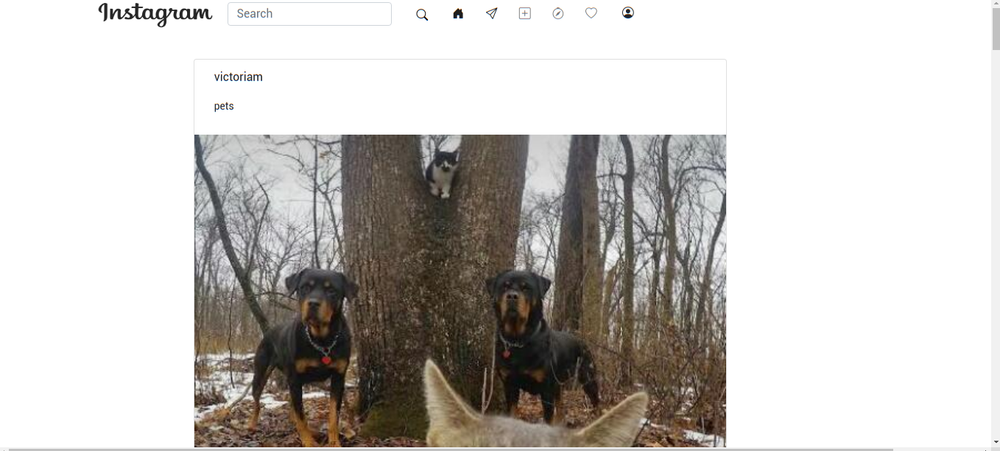
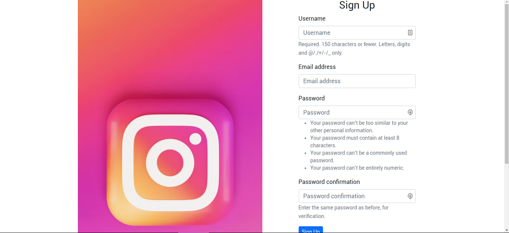

# instagram-clone
Social Network: An attempt at building an Instagram clone on the Django framework.

## Live link 
https://insta-with-a-twist.herokuapp.com/

# Landing page


# Sign up Page


### Requirements

* Either a computer,phone,tablet or an Ipad
* An access to the Internet

## Technology Used 
* HTML
* CSS
* Bootstrap 
* Python Django
* Heroku
* PostgreSql

## Setup
* Clone the repository  by typing this command on terminal```git clone https://github.com/tori-bot/instagram-clone```
* Enter your local directory by typing this command o the terminal ```cd instagram-clone```
* Install all requirements ```pip install -r requirements.txt```
* Test the application ```python3 manage.py test```
* Run server to run the application on local machine ```python3 manage.py runserver```
* Follow the local host link ```127.0.0.1:8000``` to view application on your browser.
## Known Bugs
* No know bugs. In case you discover any, please contact the author.

## License

Copyright (c) 2022 MIT License. [View License Here](LICENSE)


## Author
Email Address: [makenavictoria1@gmail.com](mailto:makenavictoria1@gmail.com)